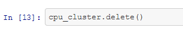

# Optimizing an ML Pipeline in Azure

## Overview
This project is part of the Udacity Azure ML Nanodegree.
In this project, we build and optimize an Azure ML pipeline using the Python SDK and a provided Scikit-learn model.
This model is then compared to an Azure AutoML run.

## Summary
Dataset contains data about marketing campaigns in banking institution. We seek to predict if campaign was successful, meaning if contacted customer subscribed to product ('yes') or not ('no'). 
Two methods were used - Scikit-learn Logistic Regression, with hyperparameters optimized using HyperDrive and AutoML.

The best performing model - VotingEnsemble, resulting in accuracy of 91.58% was found using AutoML. Best performing parameters, optimized using HyperDrive, resulted in accuracy of 91.10%.

## Scikit-learn Pipeline
Pipeline consisted of computing cluster where Logistic Regression model was trained with hyperparameters tuned with HyperDrive. Hyperdrive optimized accuracy as primary metric, by maximizing it. Optimized parameters were: C - inverse of regularization strength and parmater max_iter - maximum number of iterations taken for the solver to converge.

Parmeters C and max_iter were sampled randomly using RandomParameterSampling sampler. The C values were chosen from continous range of uniform distribution and the max_iter was chosen from discrete set of values. In random search, each hyperparameter combination from defined range has equal probability of being selected, what results in computational efficiency of the tuning proces, saving time and resources, unlike in grid search where whole range is searched exhaustively. Random search is commonly used method during hyperparematers tuning, as it results with smilary good results as grid search, but in much shorter time.

Additional early stopping Bandit policy was used. The policy helps to optimize time and resources by terminating runs that does not fall within the slack factor or slack amount of the evaluation metric with respect to the best performing run.

Picture below depicts main steps of the pipeline:

## AutoML
AutoML object was initialized with "classification" task with metric "accuracy". Seven models were trained before experiment terminated. Best model was VotingEnsemble with accuracy 91.58% followed by MaxAbsScaler XGBoostClassifier with accuracy 91.51%.

Ensemble models combine predictions of several base models in order to improve generalizability / robustness over a single estimator. In case of best model, voting classifier used soft vote method ('prefittedsoftvotingclassifier') which averages predicted probabilities (soft vote) to predict the class labels. Model used 25 estimators, with hyperparameters like min_impurity_decrease=0.0, min_impurity_split=None, min_samples_leaf=0.01, min_samples_split=0.01,min_weight_fraction_leaf=0.0 which indicates on tree based models. Ensemble models are trained as final iterations of AutoML runs.

## Pipeline comparison
Accuracy of both methods is comparable with AutoML resulting in slightly better accuracy than LogisticRegression (91.58% vs 91.10%). AutoML run is more robust as it trains many different models, applying various additonal steps like eg. scaling features and seraching for best parameters in one single task, while the same would require many runs with HyperDrive method and additional work. 

## Future work
HyperDrive method can be improved by applying wider hyperparameter selection such as adding L1 or L2 regularization and input features scaling. What is more hyperparamters search space can be imporved by initial random serach and then refining it by grid serach. Also primary metric can be changed to other, like F1-score. Furthermore dataset is imbalanced and adding class weighting could improve the model. Other models can be also manually applied and optimized with HyperDrive.
AutoML method can be run for longer, resulting in higher number of iterations and possibly even better models.
## Proof of cluster clean up
Cluster deleted in notebook:

